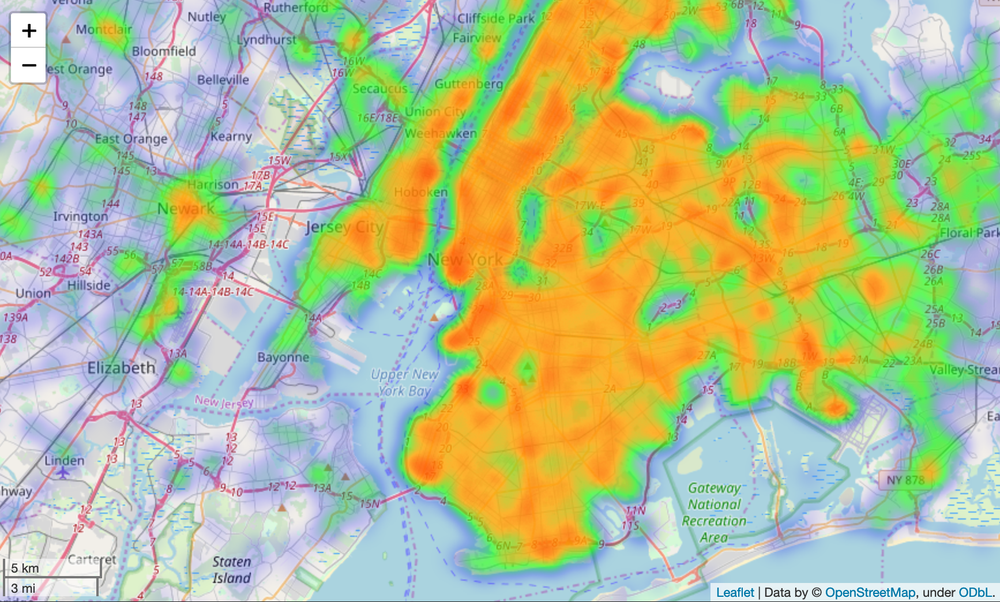

# Uber Project

This project aims at making recommendations to Uber drivers in order for them to optimize their chances of making a pickup. To that effect, we use a dataset containing data on over 500,000 Uber pickups that took place in New York City during the month of April 2014. It consists of four columns including the date and time of the Uber pickup, its latitude, its longitude and the NYC Taxi and Limousine Commission base company code affiliated with the pickup.
In this example of unsupervised machine learning, we train a K-Means model and a DBSCAN model to cluster our data and make our recommendations. They come in the form of a map of NYC in which we locate our different clusters during the month of April 2014. We also provide an interactive map to understand how the different clusters shift at different times of day. We use the Folium library to generate our maps.

